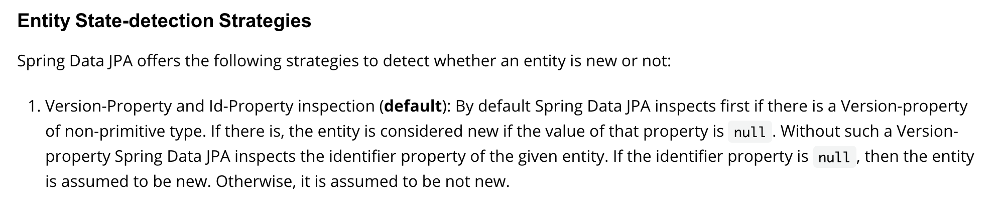

## [JPA] save전 select하는 문제

### 문제 현상

###### 개요 

  insert api에서 save method를 호출하여 객체를 저장할 때 n+1쿼리가 발생함.
 
###### Entity 구성


```

@Entity
@SuppressWarnings("LongParameterList")
class Coffee(

    @Id
    override var id: String?,

    val imageUrl: String,

    val price: Int,

    val description: String,

    val category: String,

    @OneToMany(mappedBy = "coffee", orphanRemoval = true, cascade = [CascadeType.PERSIST, CascadeType.MERGE])
    var beanCoffees: List<BeanCoffee> = mutableListOf(),


) : AbstractJpaEntity<String>() {

    override fun equalProperties(other: Any): Boolean {
        return other is Coffee &&
                id == other.id &&
                imageUrl == other.imageUrl &&
                price == other.price &&
                description == other.description &&
                category == other.category &&
                beanCoffees == other.beanCoffees
    }

    companion object {
        fun of(
            id: String,
            imageUrl: String,
            price: Int,
            description: String,
            category: String,
            beanCoffees: List<BeanCoffee>
        ) = Coffee(id, imageUrl, price, description, category, beanCoffees,)
    }

}

```

* Coffee는 Bean과 다대 관계를 가진다.
* Coffee와 Bean은 coffee 이름, bean 이름(coffee_id, bean_id)이 primary key다.

###### CoffeeService 

CoffeeService의 insert method의 코드

```
    @Transactional
    fun insert(coffeeDTO: CoffeeDTO)
        = coffeeRepository.findById(coffeeDTO.id).orElse(coffeeRepository.save(coffeeDTO.toEntity()))
```

###### Save query 

coffee를 save하기 전 연관된 entity 개수만큼 먼저 select 쿼리가 날아간다. 한번에 save하는 연관된 bean이 많아질수록 select 쿼리가 증가하여 n+1쿼리가 된다.

```


Hibernate: 
    select
        distinct coffee0_.id as id1_3_0_,
        beancoffee1_.beanId as beanid1_1_1_,
        beancoffee1_.coffeeId as coffeeid2_1_1_,
        bean2_.id as id1_0_2_,
        coffee0_.category as category2_3_0_,
        coffee0_.description as descript3_3_0_,
        coffee0_.imageUrl as imageurl4_3_0_,
        coffee0_.price as price5_3_0_,
        beancoffee1_.id as id3_1_1_,
        beancoffee1_.coffeeId as coffeeid2_1_0__,
        beancoffee1_.beanId as beanid1_1_0__,
        bean2_.description as descript2_0_2_,
        bean2_.farm as farm3_0_2_,
        bean2_.grade as grade4_0_2_,
        bean2_.kind as kind5_0_2_,
        bean2_.origin as origin6_0_2_,
        bean2_.processing as processi7_0_2_,
        bean2_.roasting as roasting8_0_2_ 
    from
        Coffee coffee0_ 
    inner join
        BeanCoffee beancoffee1_ 
            on coffee0_.id=beancoffee1_.coffeeId 
    inner join
        Bean bean2_ 
            on beancoffee1_.beanId=bean2_.id
Hibernate: 
    select
        coffee0_.id as id1_3_2_,
        coffee0_.category as category2_3_2_,
        coffee0_.description as descript3_3_2_,
        coffee0_.imageUrl as imageurl4_3_2_,
        coffee0_.price as price5_3_2_,
        beancoffee1_.coffeeId as coffeeid2_1_4_,
        beancoffee1_.beanId as beanid1_1_4_,
        beancoffee1_.beanId as beanid1_1_0_,
        beancoffee1_.coffeeId as coffeeid2_1_0_,
        beancoffee1_.id as id3_1_0_,
        bean2_.id as id1_0_1_,
        bean2_.description as descript2_0_1_,
        bean2_.farm as farm3_0_1_,
        bean2_.grade as grade4_0_1_,
        bean2_.kind as kind5_0_1_,
        bean2_.origin as origin6_0_1_,
        bean2_.processing as processi7_0_1_,
        bean2_.roasting as roasting8_0_1_ 
    from
        Coffee coffee0_ 
    left outer join
        BeanCoffee beancoffee1_ 
            on coffee0_.id=beancoffee1_.coffeeId 
    left outer join
        Bean bean2_ 
            on beancoffee1_.beanId=bean2_.id 
    where
        coffee0_.id=?
Hibernate: 
    select
        beancoffee0_.beanId as beanid1_1_2_,
        beancoffee0_.coffeeId as coffeeid2_1_2_,
        beancoffee0_.id as id3_1_2_,
        bean1_.id as id1_0_0_,
        bean1_.description as descript2_0_0_,
        bean1_.farm as farm3_0_0_,
        bean1_.grade as grade4_0_0_,
        bean1_.kind as kind5_0_0_,
        bean1_.origin as origin6_0_0_,
        bean1_.processing as processi7_0_0_,
        bean1_.roasting as roasting8_0_0_,
        coffee2_.id as id1_3_1_,
        coffee2_.category as category2_3_1_,
        coffee2_.description as descript3_3_1_,
        coffee2_.imageUrl as imageurl4_3_1_,
        coffee2_.price as price5_3_1_ 
    from
        BeanCoffee beancoffee0_ 
    inner join
        Bean bean1_ 
            on beancoffee0_.beanId=bean1_.id 
    inner join
        Coffee coffee2_ 
            on beancoffee0_.coffeeId=coffee2_.id 
    where
        beancoffee0_.beanId=? 
        and beancoffee0_.coffeeId=?
Hibernate: 
    select
        bean0_.id as id1_0_0_,
        bean0_.description as descript2_0_0_,
        bean0_.farm as farm3_0_0_,
        bean0_.grade as grade4_0_0_,
        bean0_.kind as kind5_0_0_,
        bean0_.origin as origin6_0_0_,
        bean0_.processing as processi7_0_0_,
        bean0_.roasting as roasting8_0_0_ 
    from
        Bean bean0_ 
    where
        bean0_.id=?
Hibernate: 
    insert 
    into
        Coffee
        (category, description, imageUrl, price, id) 
    values
        (?, ?, ?, ?, ?)
Hibernate: 
    insert 
    into
        Bean
        (description, farm, grade, kind, origin, processing, roasting, id) 
    values
        (?, ?, ?, ?, ?, ?, ?, ?)
Hibernate: 
    insert 
    into
        BeanCoffee
        (id, beanId, coffeeId) 
    values
        (?, ?, ?)

```

### 원인

###### Repository.save()

save method는 entity객체를 저장, 업데이트 하는 용도로 사용된다. 아래 코드는 SimpleJPARepository에 구현되어있는 save() method다.

```

@Transactional
@Override
public <S extends T> S save(S entity) {

// private final EntityManager em;

	Assert.notNull(entity, "Entity must not be null.");
	if (entityInformation.isNew(entity)) {
		em.persist(entity);
		return entity;
	} else {
		return em.merge(entity);
	}
}

```


* entityInformation.isNew()를 통해 entity가 새로 생성된 entity면 em.persist(), entity가 새로 생성된 entity가 아니면 em.merge()를 한다.
* persist()는 새로 생성된 객체를 영속성 컨텍스트에 저장하는 메소드
* merge()는 준영속 상태의 객체를 다시 영속화 하는 메소드
* Entity 영속성 context에 대한 자세한 설명은 아래 블로그 링크 참고
https://ict-nroo.tistory.com/130
* persist() method는 insert 쿼리전에 select를 하지 않는다. 저장하려고 하는 객체가 db에 없는, 새로 생성된 객체라는것을 알고 있기 때문이다. 하지만 merge() method는 한번 영속성 컨텍스트에 의해 관리되었다가 detached된 상태이기 때문에 db에 객체가 저장되어 있을 것이고, 값을 동기화 하기 위해 db내용을 확인해야 한다. 따라서 insert전 select 쿼리를 날려 값을 확인한다.


save() method의 동작에 따라 strada 에서 insert api를 호출하면 객체를 새로 생성하기 때문에 em.persist()가 호출될 것이라고 생각했지만, 실제로는 merge()가 호출되고 있었다. insert api 에서 merge()가 호출되면 n+1쿼리가 나가는 것은 당연한데, 새로 저장하려고 하는 객체 수 만큼 db에서 확인해야 하기 때문이다.

###### persist() 대신 merge()가 호출되는 이유

persist() 대신 merge()가 호출되는 이유는 Spring-JPA에서 entity객체가 new인지 아닌지를 판단하는 기준을 확인해야 한다. 아래는 Spring document에서 Entity 상태 감지 전략에 대한 설명이다.


설명에 따르면 Spring-JPA에서 @version property을 가지고 entity객체가 new인지 판단하고, 만약 @version property이 없으면 @id속성을 통해 entity객체가 new인지 판단한다. Coffee entity의 경우 string type인 coffee_id(커피 이름)를 Id-Property로 정했기 때문에 객체를 새로 생성했음에도 id값이 null이 아니기 때문에 merge()가 호출되는 것이다.

Reference
* https://docs.spring.io/spring-data/jpa/docs/current/reference/html
  

### 문제 해결

###### Spring document

Spring document에서 제시하는 문제 해결 방법은 3가지 정도를 제시한다.

1. entity에 @version property를 추가하고 null로 초기화 한다.
2. entity에 Persistable 인터페이스를 상속하고, isNew 변수와 isNew()를 구현한다.
3. EntityInformation을 커스텀 한다.
   

###### Strada 구현 방법 - @GeneratedValue(strategy = GenerationType.IDENTITY)

Coffee entity와 그 연관 entity들은 현재 @version 속성을 가지고 있지 않다.
entity에 Persistable 인터페이스를 상속하고 구현하는 것은 몇가지 예외 상황을 처리하는 추가 작업이 필요하다. EntityInformation을 커스텀 하는 방식 또한 과도한 작업을 요구하는 것 같아 다른 방법을 찾았다.

Coffee entity에 Strada의 LongJpaEntity를 상속했다.

LongJpaEntity
```

@MappedSuperclass
abstract class LongJpaEntity : AbstractJpaEntity<Long>() {

    @Id
    @GeneratedValue(strategy = GenerationType.IDENTITY)
    override var id: Long? = null
}

```

* LongJpaEntity는 Long type의 Id를 갖는 추상 클래스다.
* @Id property에 @GeneratedValue(strategy = GenerationType.IDENTITY)속성을 부여한다.
* @Id property는 객체 생성시 null로 초기화 되기 때문에 초기화와 동시에 save()할 때 merge()가 아닌 persist()가 호출될 것이다.
* @GeneratedValue(strategy = GenerationType.IDENTITY)속성을 부여했기 때문에 db에 insert된 이후 @Id값이 자동으로 생성된다.
* GeneratedValue의 strategy type은 아래와 같다.

    |Strategy Type|Description|
    |---------|---|
    |GenerationType.IDENTITY|데이터베이스에 키 생성 방법을 위임|
    |GenerationType.TABLE|데이터베이스에 키 생성 전용 테이블을 만들어 관리|
    |GenerationType.SEQUENCE|데이터베이스의 시퀸스를 이용해 키 생성|
    |GenerationType.AUTO|데이터베이스 종류에 따라 알아서 생성|


###### Coffee entity 수정

@Id를 Long type으로 변경했기 때문에 커피 이름인 name필드를 @Column(unique=true)으로 추가했다. 변경된 entity는 아래와 같다.

```

@Entity
@SuppressWarnings("LongParameterList")
class Coffee(

    @Id
    override var id: Long?,

    @Column(unique=true)
    val name: String,

    val imageUrl: String,

    val price: Int,

    val description: String,

    val category: String,

    @OneToMany(mappedBy = "coffee", orphanRemoval = true, cascade = [CascadeType.PERSIST, CascadeType.MERGE])
    var beanCoffees: List<BeanCoffee> = mutableListOf()

) : LongJpaEntity() {

    override fun equalProperties(other: Any): Boolean {
        return other is Coffee &&
                id == other.id &&
                name == other.name &&
                imageUrl == other.imageUrl &&
                price == other.price &&
                description == other.description &&
                category == other.category &&
                beanCoffees == other.beanCoffees
    }

    companion object {
        fun of(
            id: Long?,
            name: String,
            imageUrl: String,
            price: Int,
            description: String,
            category: String,
            beanCoffees: List<BeanCoffee>
        ) = Coffee(id,name, imageUrl, price, description, category, beanCoffees)
    }

}

```

###### Test


Insert API호출 시 select없이 insert query가 나간다.

Insert test
```

Hibernate: 
    insert 
    into
        Coffee
        (category, description, imageUrl, name, price) 
    values
        (?, ?, ?, ?, ?)
Hibernate: 
    insert 
    into
        Bean
        (description, farm, grade, kind, name, origin, processing, roasting) 
    values
        (?, ?, ?, ?, ?, ?, ?, ?)
Hibernate: 
    insert 
    into
        BeanCoffee
        (beanId, coffeeId) 
    values
        (?, ?)

```

###### Todo

Insert API는 해결 됐지만 Update API는 다시 수정해야 한다. Coffee entity의 name에 unique속성을 부여했기 때문에 save()로 업데이트 하려고 하면 ConstraintViolationException이 발생한다. 

